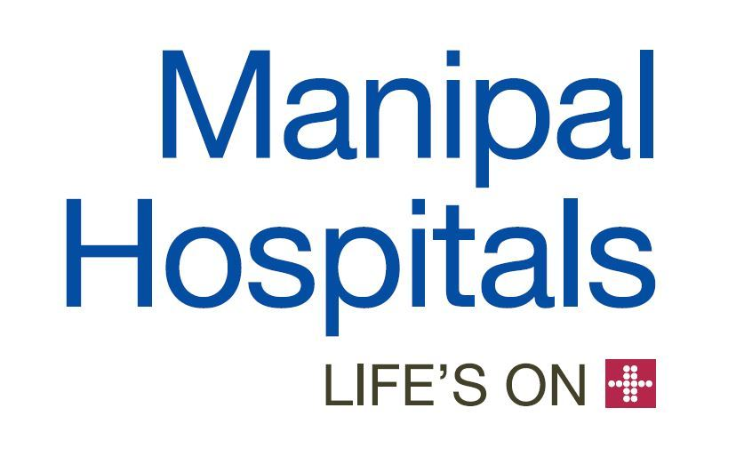

# Predicting Net Promoter Score(NPS) using Manipal Dataset

### Table of contents
* [Introduction](#introduction)
* [Problem Statement](#problem-statement)
* [Data Source](#data-source)
* [Technologies](#technologies)
* [Type of Data](#type-of-data)
* [Data Pre-processing](#data-pre-processing)
* [Algorithms Implemented](#algorithms-implemented)
* [Steps Involved](#steps-involved)
* [Evaluation Metrics](#evaluation-metrics)
* [Results and Conclusion](#results-and-conclusion)

### Introduction
The objective of the project is to use the Manipal Hospital data and predict the Net Promoter Score which would help improve the patient experience at Manipal Hospitals. 

### Problem Statement
* Predicting Net Promoter Score (NPS) to improve patients experience at Manipal Hospitals

### Data Source
* The Dataset was released by IIM Bangalore.

### Technologies
* R Programming

### Type of Data
* The data set contains patients data of Manipal Hospitals
* Train : 70%
* Test  : 30%

### Data Pre-processing
* Handling missing values
* Dealing with Outliers
* Removing variables having zero variance

### Algorithms Implemented
* Random Forest
* XGBoost
* LASSO Regression
* Ridge Regression

### Steps Involved

* Find out which are the significant variables in the dataset and store them in a separate dataframe.
* Find out the TOP 200 important variables by running Random Forest
* Filter some more variables using XGBoost and LASSO.
* Finally with the final set of variable, run prediction models and obtain the results.
  
### Evaluation Metrics  
Accuracy 

### Results and Conclusion
This dataset makes us aware of the different data cleaning processes and takes us step by step through that.
Finally, using the large customer dataset, we understand how NPS can be used as an effective tool to understand customer concerns.
